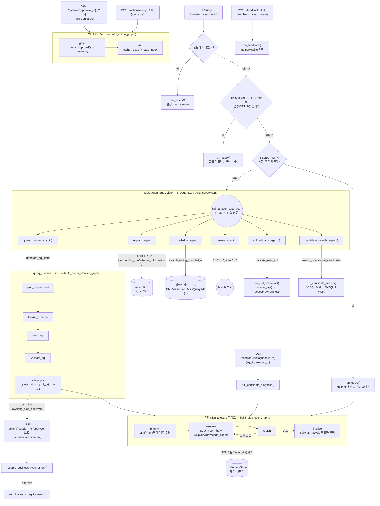
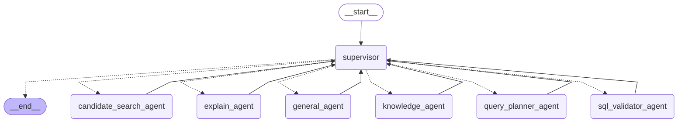

# 미니 PJT: Oracle SQL Copilot — SQL 생성·검증·운영 성능 진단 Agent

## 배포 사이트

- [UI](https://sqlmanager.ginam.dev)
- UI 로그인 User: `sds-ax` PW : `sds-ax`
- [Langfuse](https://langfuse.ginam.dev)
- Langfuse 로그인 이메일: `ginami0129n@naver.com` PW : `2oZdr_Xa9mcgDKqK`
- [Swagger API 문서](https://sqlmanager.ginam.dev/docs)

[동작 사진](DEMO.md)

## 빠른 설치 및 실행

Langfuse를 포함한 모든 서비스를 시작합니다.

```bash
cp .env.example .env
docker compose --profile langfuse up -d --build
```

실행 상태는 `docker compose ps`, 로그는 `docker compose logs -f`로 확인합니다.

## 무엇을 푸나

DBA/백엔드 담당자가 반복적으로 하는 업무를 세 가지 흐름으로 자동화한다.

### 진입점 (seed v2.7.0)

SQL 생성·SQL 검증·운영 SQL 후보 탐색은 **`POST /query`** 하나로 처리하고, 후보 선택 후 진단은
**`POST /candidates/diagnose`** 전용 엔드포인트로 분리했다 — 처음엔 이것도 `/query`에 합쳤었지만
(v2.6.0), `sql_id`는 사용자가 목록에서 카드를 클릭해 나온 값이라 분류할 자연어가 전혀 없다는
점이 드러나 다시 분리했다(아래 "왜 후보 진단은 분리했나" 참고).

`POST /query`는 `{"question": str}`(자연어 요구사항/질문 또는 SELECT/WITH SQL 원문)만 받고,
어떤 흐름인지는 서버가 판단한다 — 이 판단은 별도 분류기가 아니라 **기존 Multi-Agent
Supervisor**(`src/agents.py`의 `build_supervisor`)가 그 자체로 수행한다. Supervisor가
`query_planner_agent`/`sql_validator_agent`/`candidate_search_agent`로 위임하면, 이
에이전트들은 전용 도구 하나만 호출해 아래 표의 기존 구현(Plan-Execute 그래프·검증기·후보검색)을
그대로 실행하고 그 구조화된 결과를 그대로 API 응답으로 돌려준다.

| 흐름                                                           | 경로                          | Supervisor가 위임하는 에이전트                              | 실제 실행                                                                | 응답 mode                                              |
| -------------------------------------------------------------- | ----------------------------- | ----------------------------------------------------------- | ------------------------------------------------------------------------ | ------------------------------------------------------ |
| SQL 생성 — 비즈니스 요구사항에서 SELECT 초안 생성             | `POST /query`               | `query_planner_agent`                                     | `prepare_business_requirement` → 승인 후 `run_business_requirement` | `awaiting_plan_approval` → `business_requirement` |
| SQL 검증 — 사용자가 입력한 SELECT를 accept/revise/reject 판정 | `POST /query`               | `sql_validator_agent`                                     | `run_sql_validation`                                                   | `sql_validation`                                     |
| 운영 성능 진단(후보 탐색) — 자연어로 운영 SQL 후보 목록 조회  | `POST /query`               | `candidate_search_agent`                                  | `run_candidate_search`                                                 | `candidate_search`                                   |
| 운영 성능 진단(선택 후 진단) — 선택한 후보의 실행계획 진단    | `POST /candidates/diagnose` | (결정적 처리, Supervisor 미경유)                            | `run_candidate_diagnose`                                               | `candidate_diagnose`                                 |
| 일반/지식 질문                                                 | `POST /query`               | `explain_agent` / `knowledge_agent` / `general_agent` | 기존`run_query`와 동일한 자유 응답                                     | `knowledge`                                          |

**Agent별 토큰 정책** (`src/api.py`와 `src/agents.py`):
`X-Approver-Token` 헤더 자체가 없으면 `POST /query`는 SQL 원문이든 자연어든 Supervisor를
거치지 않고 기존 계약 그대로 `run_query`로 처리한다(헤더가 없다는 것 자체가 "보호 흐름을 쓸
생각이 없다"는 신호). 헤더가 있으면(값이 맞든 틀리든) Supervisor가 자연어를 담당 Agent에
위임한다. `query_planner_agent`·`sql_validator_agent`·`candidate_search_agent`는 전용
Tool을 실행하기 직전에 토큰을 확인해, 불일치는 403으로 끝낸다. `knowledge_agent`와
`general_agent`로 분류되면 토큰 검사 없이 그대로 처리된다. UPDATE·DELETE·DROP 등 변경/DDL
SQL은 헤더 유무와 무관하게 항상 코드로 결정적으로 차단한다(LLM 분류를 거치지 않는다).
인증 실패 시 DB·MCP·SQLite 쓰기는 발생하지 않는다.

**`POST /candidates/diagnose`**는 `{"sql_id": str, "session_id": str}`만 받고 항상
`X-Approver-Token`을 검증한다(누락 401, 오류 403). Supervisor를 거치지 않는 이유: 사용자가
이미 후보 목록에서 정확히 이 카드를 클릭해 선택을 확정했으므로, LLM에게 "무슨 의도냐"를 다시
묻는 건 불필요한 지연·비용이자 잘못 재해석될 위험만 만든다.

모든 흐름은 Oracle 대상 DB 접근에 **SQLcl MCP** 단일 경로를 사용한다(직접 DB 드라이버 접속 금지). UPDATE/DELETE SQL은 DB 접점 전에 코드 기반 가드레일에서 차단되고 SELECT 조회문만 처리된다.

### 승인책임자 정책

SQL 생성·SQL 검증·운영 후보 탐색·후보 진단과 위험 도구 실행은 **승인책임자(Approver)**만
사용할 수 있다. 지식 질문과 일반 응답은 공개한다. 보호 Agent가 실행되려는 시점에
`X-Approver-Token`을 확인하며, 누락이면 401, 불일치면 403을 반환한다.

### 마스킹 정책

이메일·전화번호·사번·비밀번호·SQL 리터럴 등 민감정보는 UI·API 응답·LLM 입력·Langfuse/FileTracer trace·로그·SQLite 저장소에 기록되기 전에 마스킹한다. 운영 SQL 후보는 구조를 보여주되 식별값과 리터럴을 마스킹한다.

DBA/백엔드 담당자가 반복적으로 하는 업무 — "느린 SQL을 받아 실행계획을 분석하고 성능 저하 원인과 개선안을 제시" — 를
자연어 질문 또는 SELECT SQL 입력으로 자동화한다. 사용자는 SELECT/WITH 조회문을 직접 입력할 수 있고(UPDATE·DELETE는
DB 접점 전에 차단), **실행계획 원문은 절대 사용자에게 입력받지 않는다** — 허용된 SQL에 대해 시스템이 SQLcl MCP로
매번 새로 조회한다. 그 위에서 Multi-Agent Supervisor가 원인 진단과 개선안을 근거와 함께 제시한다.

## 활용한 패턴 (Day 1~7)

| #  | 패턴                            | Day   | 위치                                                                                 |
| -- | ------------------------------- | ----- | ------------------------------------------------------------------------------------ |
| 1  | LCEL 구조화 출력                | Day 1 | `src/plan_execute.py`(finalize_node), `src/schemas.py`                           |
| 2  | ReAct                           | Day 3 | `src/agents.py`의 `create_agent` (도구 호출 루프)                                |
| 3  | RAG(하이브리드+리랭크+쿼리확장) | Day 2 | `src/retriever.py`                                                                 |
| 4  | 다중 도구                       | Day 4 | `src/tools.py`(db_tool/gather_stats/create_index)                                  |
| 5  | MCP 서버 연동                   | Day 4 | `src/tools.py`(SQLcl `sql -mcp`, seed v2.4.0부터 Oracle 접근 단일 경로)          |
| 6  | 가드레일                        | Day 5 | `src/guardrails.py`, `src/middleware.py`                                         |
| 7  | HITL                            | Day 5 | `src/actions.py` (interrupt/Command, 승인/수정/거절)                               |
| 8  | 미들웨어                        | Day 5 | `src/middleware.py` (4종 + MIDDLEWARE_ORDER)                                       |
| 9  | Multi-Agent Supervisor          | Day 6 | `src/agents.py`(create_supervisor)                                                 |
| 10 | Plan-Execute·장기메모리        | Day 7 | `src/plan_execute.py`(InMemoryStore)                                               |
| 11 | Observability                   | Day 7 | `src/tracing.py`(FileTracer → trace.jsonl + 응답 trace 필드 + Langfuse 콜백 병행) |
| 12 | 평가(RAGAS·LLM-as-Judge)       | Day 7 | `run_eval.py`, `src/ragas_eval.py`, `evaluation/test_queries.csv`              |

공식 요건(§5)은 1·3·11·12 4개만 필수이나, 12개 전부를 통합하기로 확정했다(권장되지 않았으나 승인됨 — seed.yaml 참고).

## 아키텍처

자연어 요청은 (빈 질문·변경/DDL SQL의 결정적 코드 차단을 제외하면) 항상 Multi-Agent Supervisor가
6개 에이전트(explain/knowledge/query_planner/sql_validator/candidate_search/general) 중 하나로
위임한다. 보호 Agent가 선택돼도 실제 Tool 호출 전까지는 권한·DB·MCP·SQLite 접근이 없다. SQL 생성은
먼저 처리 계획을 `awaiting_plan_approval` 상태로 저장하고, 사람이 승인한 뒤에만 스키마 조회·SQL
생성·실행계획 진단을 재개한다. 아래는 전체 라우팅·에이전트·서브그래프를 하나로 그린 그래프다.



### LangGraph 실행 그래프 (코드에서 추출)

위 다이어그램은 API·에이전트·외부 시스템을 포함한 전체 아키텍처이고, 아래는 최상위
`sqlmanager_supervisor`의 LangGraph 컴파일 결과다. `get_graph().draw_mermaid()`로 추출했으므로
실제 라우팅 노드와 엣지를 코드와 대조할 수 있다.

#### 최상위 Supervisor 라우팅 그래프

`src.agents.build_supervisor()`는 `sqlmanager_supervisor` 이름으로 컴파일된다. `supervisor`가
요청을 여섯 전문 Agent 중 하나에 위임하고, 해당 Agent의 결과는 다시 `supervisor`로 돌아온다.
완료된 요청만 `__end__`로 향한다. 보호 Agent의 토큰 검사는 이 라우팅 시점이 아니라 전용 도구를
호출하기 직전에 이뤄진다.



### Agent 설명 (src/agents.py)

| Agent | 담당 | 도구 | 보호 |
|---|---|---|---|
| `explain_agent` | 자연어 진단 질문의 실행계획 연산자·비용·조건 문제를 분석 | SQLcl MCP 전체 도구(`_oracle_tools()`) | 아니오 |
| `knowledge_agent` | Oracle SQL 튜닝 이론·개선 패턴 지식 질문에 답변 | `search_tuning_knowledge`(하이브리드 RAG) | 아니오 |
| `query_planner_agent` | 비즈니스 요구사항을 SELECT SQL로 설계 — 처리 계획 제시 후 사람 승인 필요 | `generate_sql_draft` | 예 |
| `sql_validator_agent` | 사용자가 입력한 SELECT/WITH를 accept/revise/reject로 판정 | `validate_user_sql` | 예 |
| `candidate_search_agent` | 자연어 운영 성능 요청에서 마스킹된 SQL 후보 목록 탐색 | `search_operational_candidates` | 예 |
| `general_agent` | 위 다섯 범주에 해당하지 않는 요청(범위 밖 질문, 인사 등) | 없음(자유 응답) | 아니오 |

"보호"인 세 Agent는 Supervisor가 위임을 결정하는 시점이 아니라, 각자의 전용 도구가 **실제로
호출되는 순간** `X-Approver-Token`을 검사한다(`src/agents.py`의 `_protected_access_result()`) —
그래서 Supervisor 자체는 인증 여부와 무관하게 항상 응답하고, 401/403은 그 안쪽에서만 발생한다.

### 도구 설명 (src/tools.py, src/retriever.py, src/validator.py)

| 도구 | 위치 | 역할 |
|---|---|---|
| SQLcl MCP 도구(`connect`/`sql_run`/`schema_information` 등 9개) | `src/tools.py`(`get_oracle_mcp_tools`) | Oracle 대상 DB와의 유일한 상호작용 경계 — 스키마 조회, SQL 실행, 실행계획(`DBMS_XPLAN`) 조회 |
| `db_tool` | `src/tools.py` | `run_query`의 진단 전용 매칭 — 자연어 질문을 대표 운영 SQL 카탈로그(또는 실DB)와 매칭해 SQL·실행계획을 가져옴 |
| `search_sql_candidates` | `src/tools.py` | `candidate_search_agent`가 호출하는 실제 구현 — Oracle `V$SQL` 공유 풀을 동적 스캔(웜업된 대표 쿼리 + 캐시된 다른 쿼리 포함), 실패 시 고정 카탈로그로 폴백 |
| `search_tuning_knowledge` | `src/retriever.py` | 하이브리드 RAG(BM25 + Chroma 벡터검색 + MultiQuery 확장 + LLM 리랭크)로 Oracle 튜닝 지식베이스 문서 검색 |
| `review_sql` | `src/validator.py` | `sql_validator_agent`가 호출하는 실제 구현 — 입력 SELECT를 accept/revise/reject로 판정하고 주석이 달린 SQL을 생성 |
| `gather_stats` | `src/tools.py` | (위험: write, 항상 mock) `DBMS_STATS.GATHER_TABLE_STATS` — HITL 승인 없이는 절대 호출되지 않음 |
| `create_index` | `src/tools.py` | (위험: write, 항상 mock) 인덱스 생성 DDL 실행 — HITL 승인 없이는 절대 호출되지 않음 |

`gather_stats`/`create_index`는 실DB 연동 이후에도 의도적으로 mock 그대로다 — 개선안은 advisory만
제공한다는 SERVICE.md 정책 때문이며, `POST /actions/apply`를 거쳐도 `gate` 노드의 `interrupt()`
승인을 통과해야만(그래도 실행 자체는 mock) `run` 노드에 도달한다.

## API 계약 (제출 규약 유지)

기존 미니 프로젝트 제출 계약인 `POST /query`의 **응답 3필드(`answer`·`contexts`·`trace`)는 그대로 유지**된다.
SQL 생성·검증·후보 탐색·후보 진단도 같은 응답 계약을 공유한다.

| 요청 유형                                     | 경로                                 | 요청 본문                                 | 승인책임자 토큰            |
| --------------------------------------------- | ------------------------------------ | ----------------------------------------- | -------------------------- |
| 진단 질문 / SELECT 직접 입력 (토큰 헤더 없음) | `POST /query`                      | `{"question": str}`                     | 불필요(기존 계약 그대로)   |
| SQL 생성·SQL 검증·후보 탐색                 | `POST /query`                      | `{"question": str}`                     | 선택된 보호 Agent에서 필수 |
| 후보 선택 후 진단                             | `POST /candidates/diagnose`        | `{"sql_id": str, "session_id": str}`    | 필수(항상 검사)            |
| SQL 생성 계획 승인                            | `POST /plans/{session_id}/approve` | `{"decision": "approve\|modify\|reject"}` | 필수                       |

공통 응답 계약:

```json
{
  "status": "ok | no_answer | blocked | awaiting_selection | ...",
  "answer": "사용자에게 보여줄 답변(마스킹 적용)",
  "contexts": [{"doc_id": "...", "text": "..."}],
  "trace": [{"step": "...", "input": "...", "output": "..."}]
}
```

- `answer`는 담당 Agent가 생성한다 — supervisor는 라우팅과 결과 조합만 담당한다.
- `contexts`는 실행계획 증거와 RAG 튜닝 문서 근거를 담는다.
- `trace`는 FileTracer가 요청 단위로 채우며, Langfuse가 없거나 실패해도 항상 채워진다.
- 차단·거부 응답에서도 세 필드는 항상 존재한다(빈 값으로 채워짐) — 클라이언트 계약이 깨지지 않는다.

## 실DB 셋업 (Oracle Database Free, Docker)

`db_tool`은 이제 mock 텍스트가 아니라 **실제 Oracle DB**에 `EXPLAIN PLAN`/`DBMS_XPLAN`을 실행해 진짜
실행계획을 조회한다. 로컬에 Oracle 클라이언트를 설치할 필요 없이 Docker 하나로 끝난다.

```bash
cd /home/ubuntu/edu/AX/sds-ax-practice/mini-pjt
cp .env.example .env   # 필요하면 비밀번호/포트 수정 (기본값 그대로도 동작함)

docker compose --profile langfuse up -d --build   # API·Oracle·Langfuse 전체 기동
# 최초 기동 시 db/init/01_setup_schema_and_data.sql이 1회 자동 실행되어
# customers/orders/order_items/payments 스키마와 7가지 성능 이슈 패턴용 데이터를 적재한다
# (수 분 소요). 아래로 진행 상황 확인:
docker compose logs -f oracle-db

# 헬스체크로 준비 완료 확인 (healthy가 뜰 때까지)
docker inspect -f '{{.State.Health.Status}}' sql-tuning-oracle
```

컨테이너를 완전히 초기화(볼륨 삭제 후 데이터 재적재)하려면
`docker compose --profile langfuse down -v && docker compose --profile langfuse up -d --build`.

### SQLcl MCP 연결 저장 (최초 1회, 호스트에서)

SQLcl MCP의 `connect` 도구는 접속 문자열을 바로 안 받고 **connmgr에 미리 저장된 연결 이름**만
받는다(실측으로 확인 — README 트라이앤에러 회고 "결정 번복 4" 참고). SQLcl/OpenJDK 21 설치와
같은 성격의 호스트 1회성 설정이므로, 이 연결이 없으면 `db_tool`/후보 탐색/후보 진단 모두
mock/에러 폴백으로 조용히 넘어간다(Docker/SQLcl가 없는 채점 환경과 동일하게 안전).

```bash
sql -S /nolog
SQL> connect -save mini_pjt_conn -savepwd appuser/"AppUser_2026!"@localhost:1521/FREEPDB1
SQL> exit
```

연결 이름을 바꾸고 싶으면 `.env`의 `SQLCL_CONNECTION_NAME`도 함께 맞춰준다(기본값 `mini_pjt_conn`).

`ORACLE_DSN`이 설정되지 않았거나 DB 접속/실행이 실패하면(예: Docker가 없는 채점 환경, 또는 이
연결 저장을 안 한 환경) `db_tool`은
과거와 동일한 고정 mock 실행계획 텍스트로 조용히 폴백한다(예외를 던지지 않음) — `src/tools.py`의
`fallback_plan` 참고. 즉 Docker 없이도 이 프로젝트는 그대로 동작하지만, **기본/권장 경로는 실DB
조회**다.

인덱스 생성·통계 재수집(`gather_stats`/`create_index`)은 실DB가 연결된 뒤에도 여전히 mock으로
남아 있다 — SERVICE.md 정책(개선안은 advisory만 제공, 자동 실행 금지)에 따른 의도된 설계다.

## Langfuse 셋업 (Observability, 셀프호스팅)

`src/tracing.py`의 자체 `FileTracer`(trace.jsonl 기록)는 그대로 유지하고, 그 위에 Langfuse 콜백을
**병행**으로 붙였다 — LLM 호출/도구 호출/Multi-Agent Supervisor의 위임 흐름을 웹 UI에서 트레이스
단위로 들여다볼 수 있다. Oracle DB와 마찬가지로 `docker-compose.yml`에 이미 정의되어 있어 별도
계정 없이 로컬에서 완전히 자체 운영된다(postgres/clickhouse/redis/minio + langfuse-web/worker).

```bash
cd /home/ubuntu/edu/AX/sds-ax-practice/mini-pjt
docker compose --profile langfuse up -d --build
# 헬스체크
curl -s http://localhost:3000/api/public/health   # {"status":"OK",...}
```

최초 기동 시 `LANGFUSE_INIT_*`(.env) 값으로 조직/프로젝트/관리자 계정/API 키가 **자동 생성**된다 —
UI에서 별도로 회원가입·프로젝트 생성을 할 필요가 없다. 브라우저로 http://localhost:3000 을 열어
`LANGFUSE_INIT_USER_EMAIL` / `LANGFUSE_INIT_USER_PASSWORD`(.env)로 로그인하면 바로 트레이스를 볼 수
있다. `src/tracing.py`의 `langfuse_callbacks()`는 `.env`의 `LANGFUSE_PUBLIC_KEY`/`LANGFUSE_SECRET_KEY`가
`LANGFUSE_INIT_PROJECT_PUBLIC_KEY`/`SECRET_KEY`와 동일한 값이어야 트레이스를 이 프로젝트로 보낸다.

Langfuse 컨테이너가 없거나 키가 비어 있어도 `langfuse_callbacks()`는 예외를 던지지 않고 빈 리스트를
반환한다 — 관측 도구 하나가 죽었다고 진단 API(`POST /query`) 자체가 500을 내면 안 되기 때문
(FileTracer는 Langfuse와 무관하게 항상 동작).

주의: `minio/minio` 이미지는 Docker Hub 정책 변경으로 인증 없이 pull이 막혀 있어
`quay.io/minio/minio` 미러를 쓴다. 또한 postgres(5432)/clickhouse/redis/minio는 호스트 포트를
노출하지 않는다 — 이 컨테이너들은 langfuse-web/worker가 컴포즈 내부 네트워크로만 접속하면 되고,
샌드박스에 이미 다른 postgres(5432)가 떠 있어 충돌을 피하기 위함이다.

## 실행 방법

```bash
# 의존성 (저장소 루트 requirements.txt 는 이미 설치돼 있다는 전제 + 이 미니프로젝트 전용 추가분)
/home/ubuntu/edu/AX/sds-ax-practice/.venv/bin/pip install -r requirements-add.txt

# API 서버 (위 "실DB 셋업"으로 Oracle 컨테이너를 먼저 띄워둔 상태 권장)
cd /home/ubuntu/edu/AX/sds-ax-practice/mini-pjt
./run.sh

# 진단 질문 (자연어 하나만, 토큰 헤더 없음 — 기존 계약 그대로.
# 실행계획 원문은 사용자에게 입력받지 않고 SQLcl MCP로 새로 조회한다)
curl -s localhost:8000/query -X POST -H 'content-type: application/json' \
  -d '{"question": "주문과 고객을 조인하는 쿼리가 느린데 원인과 개선안을 알려줘"}' | python -m json.tool

# 같은 엔드포인트에 토큰을 실으면 SQL 생성/검증/후보 탐색까지 열린다
curl -s localhost:8000/query -X POST -H 'content-type: application/json' \
  -H 'X-Approver-Token: demo-approver-token' \
  -d '{"question": "SELECT * FROM orders WHERE status = '"'"'PENDING'"'"'"}' | python -m json.tool

# SQL 생성은 먼저 처리 계획만 만들고 사람이 승인한 뒤 실행한다
curl -s localhost:8000/query -X POST -H 'content-type: application/json' \
  -H 'X-Approver-Token: demo-approver-token' \
  -d '{"question": "이번 달 미결 주문을 고객별로 보여주는 SQL을 만들어줘"}' | python -m json.tool
# -> {"status": "awaiting_plan_approval", "session_id": "...", ...}
curl -s localhost:8000/plans/<session_id>/approve -X POST \
  -H 'content-type: application/json' -H 'X-Approver-Token: demo-approver-token' \
  -d '{"decision": "approve"}' | python -m json.tool

# 후보 탐색 결과에서 선택한 sql_id로 진단(전용 엔드포인트 — 항상 토큰 필요)
curl -s localhost:8000/candidates/diagnose -X POST -H 'content-type: application/json' \
  -H 'X-Approver-Token: demo-approver-token' \
  -d '{"sql_id": "<후보 탐색 응답의 sql_id>"}' | python -m json.tool

# 평가 (1차 → 개선 → 2차)
/home/ubuntu/edu/AX/sds-ax-practice/.venv/bin/python run_eval.py --round 1
# ... round1_report.md의 실패 케이스를 보고 프롬프트/top_k/가드레일 정규식을 조정 ...
/home/ubuntu/edu/AX/sds-ax-practice/.venv/bin/python run_eval.py --round 2

# 평가 계약 검증 (LLM 쿼터 없이 재현 가능한 오프라인 실행)
# - test_queries.csv의 negative/guardrail을 규칙 기반으로 실제 실행해 거부·마스킹을 확인
# - candidate_fixtures.csv를 search_sql_candidates로 실제 실행해 기대 SQL ID 포함 여부 확인
# - round1/round2 리포트 임계값과 README·SERVICE 정책 서술을 확인
python -m pytest tests/test_evaluation_contract.py -q
```

## RAGAS 평가 결과

`evaluation/round2_report.md`(2차, 최종) 기준 — positive/edge 케이스 한정 평균(전체 통과율 90.0%,
20건 중 18건 PASS):

- context_precision: 0.778 (임계값 ≥0.6 충족 ✅)
- context_recall: 0.380 (임계값 ≥0.6, 미충족 ❌)
- answer_relevancy: 0.252 (임계값 ≥0.7, 미충족 ❌)
- faithfulness: N/A — RAGAS instructor 어댑터가 faithfulness의 NLI 판정(statements+verdict) JSON을
  `max_tokens` 한도에서 잘라먹는 문제가 이번 실행에서도 재현됐다. round2 리포트를 확정한 직후
  `max_tokens`를 4096→8192로 다시 올렸으나, 그 수정을 반영한 재실행으로 실측치를 아직 확인하지
  못한 상태다(임계값 ≥0.7, 미충족 표기).

임계값: faithfulness/answer_relevancy ≥ 0.7, context_precision/context_recall ≥ 0.6.
negative/guardrail 케이스는 RAGAS로 채점하지 않는다 — 정답이 "거부"인 케이스에 faithfulness 같은 지표를
적용하는 것은 무의미하기 때문이며, 이 케이스들은 `expected_traits`/`forbidden` 컬럼 기준 규칙기반으로만
판정한다(자세한 근거는 `seed.yaml`의 `평가 척도 적합성` 원칙 참고).

RAGAS 4지표 중 answer_relevancy·context_recall 2개는 아직 임계값 미충족이다 — 이번 라운드에서는
Multi-Agent Supervisor 라우팅 버그(자연어 성능 문의를 candidate_search_agent로 위임하지 않고 일반
채팅으로 응답하던 문제)와 V$SQL CSV 파싱 버그("no rows selected"를 가짜 후보 행으로 오인식하던
문제)를 고쳐 규칙기반 통과율을 55%→90%로 끌어올리는 데 우선순위를 뒀다. RAGAS 미달 지표는 다음
라운드에서 답변 프롬프트(핵심만 담아 관련성 높이기)와 컨텍스트 구성(explain_agent/knowledge_agent가
실제 호출한 도구 응답을 retrieved_contexts로 노출하는 로직을 이번에 새로 추가했다)을 조정해 계속
개선한다.

### 미달 지표 원인 분석

- **context_recall (0.380)** — 시스템 답변 품질보다 **평가 스크립트 쪽 결함**이 더 크다.
  `run_eval.py`가 RAGAS의 `reference`(정답 근거)를 `test_queries.csv`의 `expected_traits`
  컬럼을 그대로 세미콜론으로 이어붙여서 만든다(예: `"형변환;TO_NUMBER;인덱스"`). RAGAS는 이
  문자열을 자연스러운 정답 문장으로 가정하고 클레임 단위로 분해해 컨텍스트가 그 클레임을
  뒷받침하는지 채점하는데, 단어 나열은 문장으로서의 클레임 분해가 불안정해 recall이 실제보다
  낮게 나온다. → 다음 라운드에서 CSV에 자연어 reference 문장 컬럼을 추가하는 것으로 개선 예정.
- **answer_relevancy (0.252)** — RAGAS는 답변에서 "이 답이 어떤 질문의 답일지"를 역으로 여러 개
  생성해 원래 질문과의 임베딩 유사도를 평균낸다. 우리 진단 답변(`_format_analysis_as_answer`)은
  원인 여러 개 + 근거 + 개선안 여러 개를 한 번에 나열하는 포괄적 구조라, 역생성된 질문들이 원래의
  좁은 질문 하나와 흩어져 매칭되면서 평균이 낮아지는 경향이 있다. 이는 **답변의 포괄성(사용자
  입장에서는 장점)과 이 지표 사이의 실제 트레이드오프**이며, 진단 내용을 쳐내서 점수만 올리는
  식의 수정은 하지 않았다 — 대신 summary 문장이 사용자 질문의 표현을 더 직접 반영하도록 하는 등
  내용을 해치지 않는 선에서 다음 라운드에 조정할 계획이다.
- **faithfulness (N/A)** — 위 "RAGAS 평가 결과" 항목 참고 (`max_tokens` 절단 문제, 수정은 반영했으나
  재검증 전).

## 인-아웃 세트 통과율 (자체 평가)

- 1차 (round1): `evaluation/round1_report.md` 참고, 목표 ≥ 70%
- 2차 (round2, 개선 후): `evaluation/round2_report.md` 참고, 목표 ≥ 90%
- 개선폭: round2_report.md의 "Round 1 대비 개선폭" 섹션에 카테고리별/RAGAS 지표별 수치로 기록됨
- 후보 검색 fixture: `evaluation/candidate_fixtures.csv`(cf01~cf08). 자연어 운영 성능 요청에 대해
  기대 SQL ID가 후보 목록에 포함되는지를 `tests/test_evaluation_contract.py`가 실제 검색 실행으로 검증한다
  (LLM 호출 없이 재현 가능하므로 쿼터와 무관하게 회귀 검증에 쓸 수 있다).

## 트라이앤에러 회고

- **시도했지만 실패/보류한 접근**:

  - `analyze_pasted_plan`(사용자가 SQL/실행계획을 직접 붙여넣는 폴백)을 초기에 구현했으나, "붙여넣기 금지 —
    반드시 실시간 DB 조회로만 진단" 정책을 확정하면서 전면 폐기하고 `db_tool`(mock V$SQL 픽스처 키워드 매칭)로
    교체했다.
  - RAGAS 연동 시 `ragas` 0.4.3이 import 시점에 `langchain_community.chat_models.vertexai`를 참조하는데
    이 프로젝트의 `langchain-community`(0.4.2, deprecated)에는 그 모듈이 없어 즉시 ImportError가 났다.
    실제로 VertexAI를 쓰지 않으므로 더미 모듈을 `sys.modules`에 등록하는 국소적 호환성 shim으로 우회했다
    (`src/ragas_eval.py` 상단 주석 참고).
  - RAGAS의 신규 `metrics.collections` API가 LangChain 모델을 직접 받지 못하고 "modern"(instructor 기반)
    어댑터만 받아, `anthropic` SDK의 `AnthropicBedrock` 클라이언트로 우회 연결했다. 임베딩도 동일한 이유로
    `BedrockEmbeddings`를 `BaseRagasEmbedding`으로 감싸는 얇은 어댑터를 직접 작성했다.
  - 배치 모드(일간 V$SQL 스캔)는 공식 요건이 아니고(§4-2 API 계약에 없음) service.md에서 스스로 얹은 확장
    목표라, 실DB 연동·모델 폴백·RAGAS 안정화 등 필수 요건에 시간을 우선 배분하며 설계만 하고 구현은
    보류했다(seed.yaml의 명시적 선택지였던 batch 확장 범위 밖 처리).
- **최종 채택한 접근과 이유**: `run_eval.py` 참고 — 규칙기반(전 카테고리) + RAGAS(positive/edge만) 이원화,
  `temperature=0`/`timeout=30s`/1회 실행으로 게이트 재현성을 담보.
- **결정 번복: mock 전용 → 실DB 연동**: 최초엔 "이 샌드박스와 채점 환경 모두 실제 Oracle DB가 없다"는 전제로
  `db_tool`을 고정 mock 픽스처 전용으로 설계했다(seed.yaml v1.1.0). 이후 사용자 요청으로 이 전제를 뒤집어
  `docker-compose.yml`(gvenzl/oracle-free)로 로컬 Oracle Database Free 인스턴스를 실제로 구성했고,
  `db_tool`은 이제 그 위에서 진짜 `EXPLAIN PLAN`/`DBMS_XPLAN`을 실행해 7가지 성능 이슈 패턴을 실데이터로
  재현한다(`db/init/01_setup_schema_and_data.sql`). `ORACLE_DSN` 미설정/접속 실패 시에는 과거의 고정 mock
  텍스트로 조용히 폴백해 Docker가 없는 환경(예: 채점 서버)에서도 깨지지 않는다 — "실DB 우선, mock은
  안전망"으로 정책이 바뀐 것이며 이전 결정을 숨기지 않고 여기 기록한다. 자연어 질문→쿼리 매칭 방식(고정
  카탈로그 키워드 매칭)은 그대로 유지되나, 아래 결정 번복(seed v2.4.0)에서 DB 접근 경로와 붙여넣기
  금지 정책 자체가 다시 바뀌었다.
- **결정 번복 2: 직접 드라이버 → SQLcl MCP 단일 경로, 붙여넣기 금지 → SQL 직접 입력 허용(seed v2.4.0)**:
  위 결정에서 기본 경로였던 직접 Oracle 드라이버(`oracledb.connect`) 접속을 전면 제거하고, 스키마 조회·실행계획
  조회·제한 실행 등 Oracle 대상 DB와의 모든 상호작용을 SQLcl MCP 단일 경로로 통일했다(`src/tools.py`).
  동시에 "SQL/실행계획 붙여넣기 금지"였던 기존 정책도 부분적으로 뒤집었다 — **실행계획 원문**은 여전히
  사용자에게 입력받지 않고 SQLcl MCP로 매번 새로 조회하지만, **SQL 원문 자체**는 `POST /validate`로 사용자가
  직접 입력할 수 있게 됐다(단일 SELECT/WITH만 허용, UPDATE/DELETE는 DB 접점 전에 코드 가드레일로 차단).
  이전 버전 문서·주석에 남아 있던, SQL 원문 입력 자체를 금지한다는 취지의 서술은 이 정책 변경 이후
  stale한 상태로 방치됐던 것을 이번에 정리했다 — 정직하게 기록해둔다.
  또한 SQLcl(OpenJDK 21 필요, 이 환경 기본 java는 8이라 별도 설치)을 설치해 `sql -mcp` 기반 Oracle 공식
  MCP 서버 연동도 실제로 동작하도록 구성했다 — `get_oracle_mcp_tools()`가 `connect`/`sql_run`/
  `schema_information` 등 9개 도구를 정상적으로 가져오며, explain_agent가 자동으로 사용할 수 있다. 다만
  진단 파이프라인의 기본 경로는 여전히 결정적인 `db_tool` 직접 접속이고, MCP는 확장/탐색 경로로만 둔다
  (진단 결과의 재현성을 LLM 기반 MCP 호출의 비결정성에 의존시키지 않기 위함).
- **결정 번복 3: 흐름별 전용 엔드포인트(`/generate`·`/validate`·`/candidates`·`/candidates/diagnose`)
  → 단일 통합 진입점 `POST /assist`(seed v2.5.0)**: 데모 UI가 흐름마다 탭을 나눠 사용자가 매번
  수동으로 골라야 했는데, 정작 `src/prompts/supervisor.py`에는 "사용자 요청을 분석해 담당 에이전트로
  라우팅하라"는 프롬프트가 이미 작성돼 있으면서 어디서도 import되지 않는 죽은 코드로 남아 있었다
  (`test_prompt_modules.py`의 `ac_prompt_module_management`가 role 목록에 `supervisor`를 요구하지만
  실제 사용 여부는 검증하지 않아 그동안 통과해온 것). 처음엔 이 supervisor 프롬프트로 별도의 가벼운
  분류기(`classify_intent`)를 새로 만들어 4개 라우트를 대체하려 했으나, 이 프로젝트에는 정확히
  이 역할을 하는 **기존 Multi-Agent Supervisor**(`src/agents.py`의 `build_supervisor`, 6개
  에이전트를 이미 거느리고 있음)가 있는데 별도 분류기를 하나 더 두는 건 라우팅 로직이 두 군데로
  쪼개지는 것이라는 지적을 받고 방향을 바꿨다. 최종적으로: `query_planner_agent`/
  `sql_validator_agent`/`candidate_search_agent`(기존에는 범용 Oracle MCP 도구를 든 얕은 ReAct
  에이전트였다)를 각각 `run_business_requirement`/`run_sql_validation`/`run_candidate_search`를
  그대로 호출하는 전용 도구 하나만 든 에이전트로 다시 만들고, `POST /assist`는 입력을 Supervisor에
  그대로 넘긴다. 도구의 구조화된 결과(sql_draft/candidates/annotated_sql 등)가 Supervisor의 최종
  채팅 응답 문장으로 뭉개지지 않게 돌려받는 방법을 세 번 시도 끝에 정했다 — 실제로 서버를 띄워
  SELECT 하나를 넣어보며 매번 확인했다:

  1) 요청 범위 `ContextVar`에 도구가 결과를 `set()` — 실패. 도구는 정확히 실행되는데(trace에는
     `validate_user_sql` 호출이 찍힘) 최종 응답은 `mode: "knowledge"` 텍스트로만 돌아왔다.
     LangGraph가 도구 호출을 별도 asyncio Task로 실행해서, 자식 Task가 `set()`한 값이 부모 Task로
     역류하지 않기 때문이었다(자식은 생성 시점 값을 읽을 수는 있어도 쓴 값을 부모에게 돌려줄 수
     없다).
  2) 도구 결과를 JSON으로 `ToolMessage.content`에 담고 Supervisor 실행 후 최상위 메시지 목록에서
     찾기 — 역시 실패. `build_supervisor().ainvoke(...)`로 메시지 목록을 직접 덤프해보니
     `langgraph_supervisor`는 하위 에이전트의 내부 도구 호출 기록(ToolMessage)을 상위 스레드에
     아예 올려보내지 않고, 그 에이전트의 최종 요약 AIMessage 하나만 상위로 전달한다는 걸 확인했다.
  3) (채택) 프로세스 전역 `dict`(`src/agents.py`의 `_assist_results`)에 도구가 결과를 담고, 요청마다
     발급한 UUID를 `ContextVar`(부모→자식 방향이라 안전하게 전파됨)로 각 Task에 전달해 그 키로
     기록·회수한다. `dict`는 Task마다 복사되는 `ContextVar`와 달리 같은 객체 참조를 공유하므로
     자식이 쓴 값을 부모가 그대로 읽을 수 있다 — 이건 실제로 붙여서 SELECT/후보탐색/생성 요청을
     넣어보고 구조화된 필드가 그대로 돌아오는 것까지 확인했다(`src/pipeline.py`의
     `run_via_supervisor` 참고). `src/prompts/supervisor.py`는
     이제 `SYSTEM_PROMPT`를 `src/agents.py`가 직접 import하는 실제 Supervisor 프롬프트다.
     강제로 다시 끼워 맞추기보다 남은 사실을 정직하게 기록해둔다. 분류와 실행이 Supervisor 안에서
     한 번에 일어나는 만큼 "보호된 의도일 때만" 조건부로 토큰을 검사할 수 없어져, `POST /assist`는
     입력과 무관하게 항상 `X-Approver-Token`을 요구하도록 정책을 단순화했다(토큰 없이 쓰는 순수
     진단·지식 질문은 기존 `POST /query`가 그대로 담당하므로 이 정책 변화로 잃는 기능은 없다).
- **결정 번복 4: `/assist`도 다시 `/query`로 흡수(seed v2.6.0) + 후보 탐색을 실제 V$SQL 동적
  스캔으로 전환**: `/query`와 `/assist` 두 엔드포인트를 유지할 이유가 없다는 지적을 받아
  `QueryRequest`를 `question`/`sql_id`/`session_id`로 확장하고 `/assist`를 삭제했다 — 기존처럼
  `{"question": str}`만 보내는 호출은 완전히 동일하게 동작한다(하위호환). 토큰 헤더 존재 여부로
  분기하도록 단순화했다(있으면 검증 후 Supervisor 전체 라우팅, 없으면 기존 `run_query`).
  동시에 후보 탐색(`search_sql_candidates`)이 여전히 고정 Python dict(`QUERY_CATALOG`) 키워드
  매칭이라는 지적을 받았다 — "자연어로 운영 SQL을 찾는다"는 게 결국 실제 최근 실행된 쿼리를
  찾아 개선하고 싶은 것이므로, 진짜 Oracle `V$SQL`을 SQLcl MCP로 동적 스캔하도록 바꿨다.
  `V$SQL`은 인스턴스 메모리에만 있고 `db/init/*.sql`은 볼륨이 빌 때 딱 1회만 실행되므로, 대표
  운영 쿼리 8개를 DB 초기화가 아니라 **API 서버 기동 시점에 SQLcl MCP로 직접 실행**해 공유 풀에
  올려두는 웜업(`warmup_operational_queries`, `src/api.py` FastAPI startup 이벤트)을 추가했다 —
  컨테이너를 재시작해도 API 서버만 다시 뜨면 검색 가능한 상태로 복구된다. 선택한 후보의
  `sql_id`는 이제 진짜 `V$SQL.SQL_ID`이고, 진단(`run_candidate_diagnose`)은 그 ID로
  `DBMS_XPLAN.DISPLAY_CURSOR`를 직접 조회한다(공유 풀에서 사라졌으면 다시 탐색하라고 안내,
  Oracle 미설정이면 기존 `QUERY_CATALOG`로 폴백).

  이 작업 도중 뜻밖의 발견을 했다 — **SQLcl MCP를 통한 실DB 조회 경로가 이 프로젝트 시작부터
  한 번도 실제로 성공한 적이 없었다.** 실측해보니 원인이 두 가지였다:

  1. `_sqlcl_mcp_fetch_plan`/`_sqlcl_mcp_run_user_sql`이 찾던 도구 이름
     (`run_statement`/`sql`/`execute_sql`/`run_sql`)이 실제 SQLcl MCP 서버가 노출하는 도구 이름과
     전혀 안 맞았다(실제 이름은 `sql_run`) — 그래서 매번 조용히 `tools_list[0]`(`connections_list`,
     완전히 엉뚱한 도구)로 폴백하고 있었다.
  2. `_sqlcl_connected_config()`가 접속 문자열(`user/pass@dsn`)을 SQLcl CLI 인자로 넘기면 MCP
     세션도 자동 접속될 거라 가정했는데, 실측해보니 `sql_run` 호출이 항상 "Connection not
     established"를 반환했다. SQLcl MCP의 `connect` 도구는 CLI 인자가 아니라 **connmgr에 사전
     저장된 연결 이름만** 받는다("Connection not found: appuser" 에러로 확인) — 그리고 이 호스트엔
     저장된 연결이 아예 없었다.

  즉 `db_tool`의 "실DB 우선, mock은 안전망" 정책은 코드상 의도는 맞았지만, 실행 단계에서는 항상
  안전망(mock/에러)만 타고 있었던 것 — 조용한 폴백 설계가 오히려 이 버그를 오래 숨겼다. 호스트에서
  `sql -S /nolog` 후 `connect -save mini_pjt_conn -savepwd appuser/"AppUser_2026!"@localhost:1521/ FREEPDB1`로 연결을 한 번 저장하고, 도구 이름 후보 목록에 `sql_run`을 추가한 공통 헬퍼
  `_connect_and_get_sql_tool`(`src/tools.py`)로 정리해 실측으로 해결을 확인했다 — 이제 SQL
  검증·진단·후보 탐색 모두 진짜 Oracle 응답을 받는다. 이 연결 저장은 SQLcl/OpenJDK 21 설치와
  같은 성격의 **호스트 1회성 설정**이라 "실DB 셋업" 절에 반영했다.

  MCP 연결이 되고 나서도 V$SQL 동적 검색을 실제로 붙여보며 두 가지를 더 발견해 고쳤다:

  - **같은 후보가 여러 번 나옴**: `V$SQL`은 같은 `SQL_ID`라도 자식 커서(bind peeking 등)별로
    행이 여러 개일 수 있다 — 후보 목록에 동일한 `sql_id`가 실행 통계만 다르게 3번 찍혀 나왔다.
    `GROUP BY sql_id`로 합쳐서 해결했다.
  - **`ORA-00935: group function is nested too deeply`**: `GROUP BY` 쿼리에서
    `ORDER BY SUM(elapsed_time) DESC`처럼 이미 `SELECT`에 별칭으로 뽑아둔 집계함수를 `ORDER BY`에서
    다시 감싸면 Oracle이 이 에러를 던진다 — `ORDER BY elapsed_time DESC`(별칭 그대로 참조)로
    고쳤다. 더 중요한 건 이 에러가 예외가 아니라 sql_run 도구의 **평문 텍스트 응답**으로
    돌아온다는 점이었다 — CSV 파서가 이걸 헤더/데이터로 잘못 해석해 `AttributeError`로 깨졌다.
    `_parse_sql_run_csv`가 `"Error"`/`"ORA-"` 패턴을 먼저 감지해 명시적으로 예외를 올리도록
    고쳐서, 이후 어떤 SQL 실수가 나도 조용히 폴백하게 만들었다.
- **결정 번복 5: 후보 진단을 다시 `/query`에서 분리(seed v2.7.0) + 생성 SQL도 근본 원인
  진단까지**: "후보 진단도 Supervisor에 통합할 수 없냐"는 질문에 답하는 과정에서, `sql_id`는
  사용자가 목록에서 카드를 클릭해 나온 값이라 애초에 분류할 자연어가 없다는 게 명확해졌다 —
  이미 확정된 선택을 LLM에게 다시 "무슨 의도냐"고 묻는 건 불필요한 지연·비용이자 잘못
  재해석될 위험만 만든다. 그래서 v2.6.0에서 `/query`에 합쳤던 후보 진단을 `POST /candidates/diagnose` 전용 엔드포인트로 다시 뺐다 — `/query`는 이제 순수하게 "자연어
  question 입력" 전용이고, 후보 진단은 "이미 확정된 sql_id 선택" 전용이다. 같은 대화에서
  "생성된 SQL도 후보 진단처럼 근본 원인 분석을 받아야 하지 않냐"는 지적도 나왔다 — 확인해보니
  `query_planner_agent`의 `review_plan` 단계는 실행계획 위험도(`risk_assessment`, LOW/MEDIUM/
  HIGH)만 산출하고, 후보 진단·직접 SQL 진단이 받는 근본 원인·개선안 분석(`analysis`,
  explain_agent+knowledge_agent 기반)은 받지 못하고 있었다 — 위험도만으로는 "왜"가 안 보이는
  불일치였다. `_review_plan_node`를 async로 바꿔 캐시된 진단 그래프(`pipeline._diagnosis_graph`,
  다른 두 흐름과 같은 SQL 지문 기반 장기 메모리를 공유)를 함께 호출하도록 확장해 세 흐름 모두
  같은 품질의 진단을 제공하게 했다. UI에도 대응하는 변경을 넣었다 — SQL 생성/검증 결과에는
  "수정해서 재요청"(입력창에 채워주기만 함), 진단 결과에는 "수정해서 재진단"(입력창에 채운 뒤
  별도 "실행계획 진단" 버튼으로 토큰 무관하게 결정적 진단 경로를 강제 재요청) 버튼을 추가했고,
  채팅 목록도 최신 요청이 위로 오도록 바꿨다.
- **모델 폴백 관련 트라이앤에러**: 실습 계정의 Bedrock 일일 토큰 쿼터가 반복적으로 고갈되어(`ThrottlingException`),
  `src/common.py`에 `MultiModelChatBedrockConverse`(쓰로틀링 시 `FALLBACK_MODEL_IDS` 순서로 즉시 다음 모델로
  재시도)를 추가했다. 과정에서 실제로 겪은 문제들:

  - `_is_throttling_error`가 처음엔 botocore 예외(`e.response`가 dict)만 인식했는데, RAGAS 쪽 anthropic SDK
    (`AsyncAnthropicBedrock`) 예외는 `e.response`가 httpx `Response` 객체라 `.get()` 호출 시
    `AttributeError`로 깨졌다 — dict/객체 두 형태를 모두 안전하게 처리하도록 수정.
  - `ReadTimeoutError`(우리가 건 30초 timeout)는 `ThrottlingException`이 아니라서 폴백 대상으로 인식되지
    않아, 쿼터가 고갈된 상황에서 응답이 늦어지면 다음 모델로 넘어가지 못하고 그대로 실패했다 —
    `_is_throttling_error`에 타임아웃류 예외도 포함하도록 수정.
  - 폴백 후보 마지막 단계인 Nova(`us.amazon.nova-*`)는 이 프로젝트가 전반적으로 의존하는
    `with_structured_output`/도구 호출 방식과 호환되지 않아(`OutputParserException: Unknown tool type`),
    Claude 계열이 전부 쓰로틀링된 극단적 상황에서는 Nova로 넘어가도 즉시 실패한다 — 실측으로 확인했고,
    현재는 "최후 수단으로 시도는 하되 실패해도 감수" 수준으로만 두고 있다(구조화 출력 없는 별도
    경로를 Nova용으로 새로 만드는 것은 범위 밖으로 보류).
  - RAGAS instructor 어댑터의 `max_tokens` 기본값을 1024로 좁게 잡았다가 `faithfulness` 지표의 NLI
    판정 JSON(문장이 많을 때)이 중간에 잘려(`InstructorRetryException: EOF while parsing a list`)
    항상 `N/A`로 떨어지는 문제를 겪었다 — 4096으로 올려 해결.
- **남은 한계**:

  - 로컬 샌드박스에서 Docker 컨테이너 최초 기동 시 알 수 없는 원인(호스트 네트워크 재구성 추정)으로
    컨테이너가 재시작되어 초기화 스크립트가 중간에 끊기는 현상을 겪었다 — `docker compose down -v && up -d`로
    볼륨을 비우고 재기동하면 해결되지만, 채점 환경에서도 동일 증상이 재현될 가능성을 배제할 수 없다. 이
    때문에 `db_tool`의 mock 폴백 경로(예외를 던지지 않고 조용히 대체)를 안전망으로 유지했다.
  - 실제 Oracle DB 프로비저닝은 여전히 "1회성 로컬 Docker 컨테이너" 수준이며, 운영급 배포(백업, 고가용성,
    실제 자격증명 관리)는 범위 밖이다 — `.env`의 개발용 고정 비밀번호는 로컬 데모 전용이다.
  - 위험 쓰기 도구(`gather_stats`/`create_index`)는 실DB 연동 이후에도 의도적으로 mock으로 남겨뒀다
    (SERVICE.md의 advisory-only 정책 유지 — 실DB에 실제 DDL/통계 재수집을 자동 실행하지 않는다).

## 핵심 코드 위치

- `src/api.py` — FastAPI 진입점 (`POST /query`와 `POST /candidates/diagnose`, SQL 생성 계획 승인)
- `src/pipeline.py` — 입력검증·가드레일·SQLcl MCP 조회·요청 유형 오케스트레이션(`run_query`,
  `run_business_requirement`, `run_sql_validation`, `run_candidate_search`, `run_candidate_diagnose`,
  `run_via_supervisor` — `/query`가 토큰과 함께 Supervisor에 위임한 결과를 회수)
- `src/tools.py` — SQLcl MCP 단일 경계(스키마/후보/실행계획/제한 실행), `warmup_operational_queries`
  (V$SQL 웜업), `search_sql_candidates`(V$SQL 동적 조회 + 카탈로그 폴백) + 위험 도구(gather_stats/create_index)
- `src/validator.py` — 입력 SELECT의 accept/revise/reject 판정
- `src/plan_risk.py` — 실행계획 위험 평가와 제한 실행 허용 게이트
- `src/auth.py` — 승인책임자 토큰 검증(401/403)과 감사 기록
- `src/storage.py` — checkpoints.sqlite(세션 상태) / memory.sqlite(장기기억) 분리
- `src/prompts/` — 역할별 system prompt 모듈
- `src/retriever.py` — 하이브리드 RAG (BM25 + Chroma + MultiQuery + LLM 리랭크)
- `src/agents.py` — explain_agent/knowledge_agent/query_planner_agent/sql_validator_agent/
  candidate_search_agent/general_agent + Supervisor 조립. 뒤 세 에이전트는 전용 도구
  (`generate_sql_draft`/`validate_user_sql`/`search_operational_candidates`)로 pipeline.py의
  기존 구현을 그대로 호출한다.
- `src/plan_execute.py` — Plan-Execute 그래프(query_planner의 review_plan 단계가 risk_assessment
  산출 후 진단 그래프까지 함께 호출 — 생성 SQL도 후보/직접 진단과 동일한 근본 원인 분석을 받음) +
  진단 그래프 + 장기 메모리
- `src/actions.py` — HITL 승인 그래프
- `src/ragas_eval.py` — RAGAS 4지표 (Bedrock 연동 어댑터)
- `run_eval.py` — 평가 실행기 (규칙기반 + RAGAS, round1/round2 리포트 생성)
